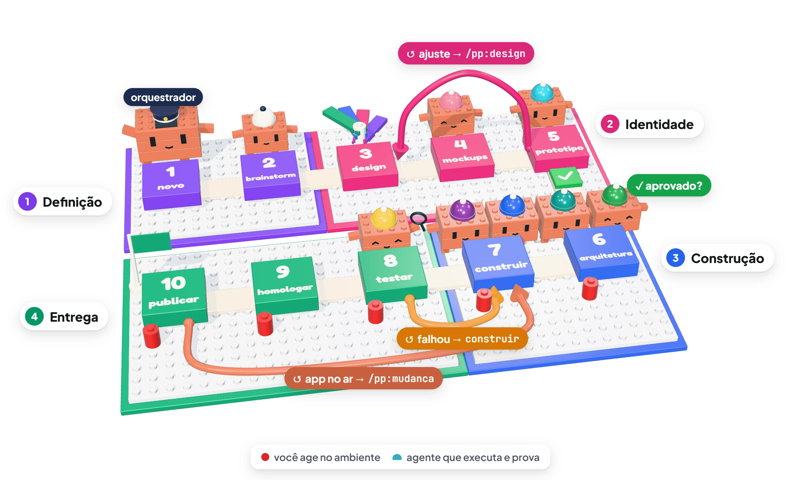
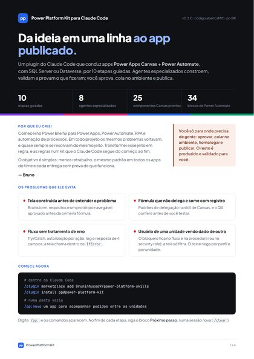
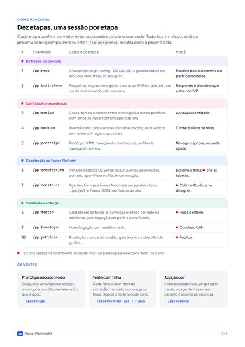
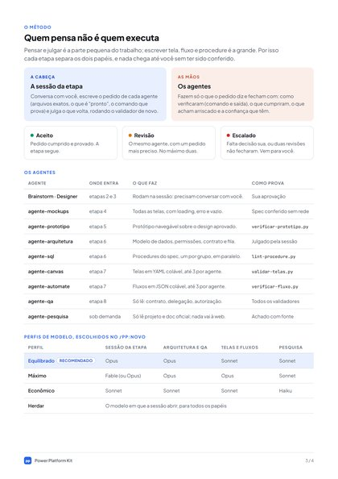
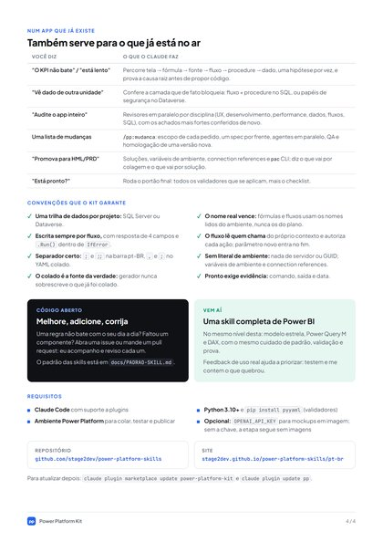
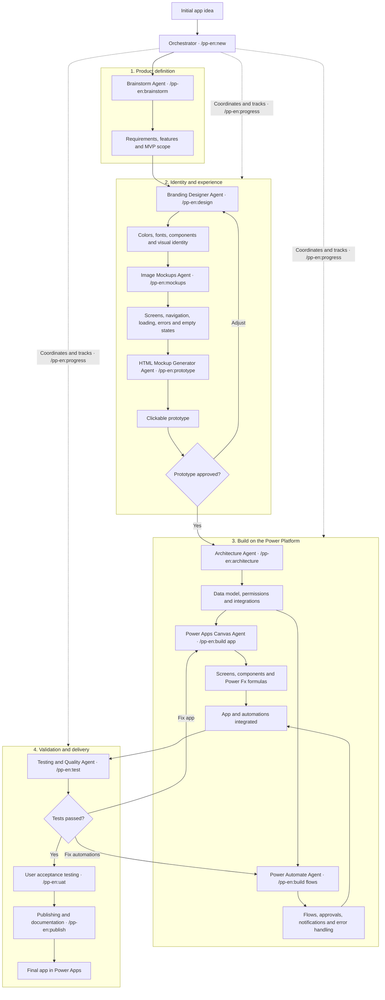

<div align="center">

[🇧🇷 Português](README.md) · 🇺🇸 English

<a href="https://stage2dev.github.io/power-platform-skills/diagrama/">
  <picture>
    <source media="(prefers-color-scheme: dark)" srcset="docs/img/pipeline-escuro.webp">
    
  </picture>
</a>

# Power Platform Kit for Claude Code

**From a one-line idea to a published app.**<br>
Power Apps Canvas + Power Automate, on SQL Server or Dataverse: one guided command per stage,
agents that build and prove what they did, and you only where a person is needed.


[**Site**](https://stage2dev.github.io/power-platform-skills/) ·
[**3D diagram**](https://stage2dev.github.io/power-platform-skills/diagrama/) ·
[**PDF presentation**](docs/Power-Platform-Kit.pdf) ·
[**Installation**](#installation) ·
[**Contribute**](#how-to-contribute)

</div>

---

## In 30 seconds

```text
/plugin marketplace add stage2dev/power-platform-skills
/plugin install pp-en@power-platform-kit
/pp-en:new an app to track orders across units
```

> **Coming soon:** the `pp-en` plugin (English commands, `/pp-en:*`) is being translated and has no
> skills yet. Until it ships, install `pp`, the pt-BR edition of the same pipeline (`/pp:novo` and so
> on): see [Installation](#installation).

Then just follow the **Next step** block that closes each stage. Requirements and other ways to
install are in [Installation](#installation).

> **Language.** The kit is maintained in **Brazilian Portuguese (pt-BR)** and **English (en-US)**,
> and every change lands in both languages. Today the stages, rules, templates and site are in
> pt-BR; the en-US version is under construction, starting with this README. Power Fx follows each
> language's formula bar: in en-US, `,` separates arguments and `;` chains; in pt-BR, `;` and `;;`.

## Why it exists

I started in Power BI and moved on to Power Apps, Power Automate, RPA and process automation. On
every project the same problems came back, and they were almost always solved the same way. I
turned that way into rules, and the rules into a kit that Claude Code follows from start to finish:
less rework, the same standard across every app, and every delivery with proof that it works.

| The usual problem | What the kit does |
|---|---|
| Screens built before the problem is understood | Brainstorm, requirements and an approved clickable prototype before the first formula |
| A formula that doesn't delegate and drops records | Delegation patterns in the Canvas skill, and QA checks them before you test |
| A flow with no error handling | Try/Catch, per-action authorization, logging and a 4-field response; the screen calls it inside `IfError` |
| A user from one unit seeing another unit's data | The block lives in the flow and the procedure (or in the security role); the screen only filters, and the test denies by role and by unit |

## PDF presentation

Four pages to send to your team: what it is, the ten stages, who thinks and who executes, and the
conventions. [**Download the PDF**](docs/Power-Platform-Kit.pdf) (in Portuguese for now; the English
edition is on its way).

<table>
  <tr>
    <td><a href="docs/Power-Platform-Kit.pdf"></a></td>
    <td><a href="docs/Power-Platform-Kit.pdf"></a></td>
    <td><a href="docs/Power-Platform-Kit.pdf"></a></td>
    <td><a href="docs/Power-Platform-Kit.pdf"></a></td>
  </tr>
</table>

<details>
<summary><strong>Contents</strong></summary>

- [How it works](#how-it-works)
- [Requirements](#requirements)
- [Installation](#installation)
- [Your first app, step by step](#your-first-app-step-by-step)
- [The agents](#the-agents)
- [Working on an existing app](#working-on-an-existing-app)
- [Component catalogs](#component-catalogs)
- [Conventions the kit guarantees](#conventions-the-kit-guarantees)
- [Repository layout](#repository-layout)
- [How to contribute](#how-to-contribute)
- [Next steps](#next-steps)
- [Credits and trademarks](#credits-and-trademarks)
- [License](#license)

</details>

---

## How it works

The diagram at the top is the whole pipeline: ten stages in four blocks, from the idea (`1`) to the
published app (`10`). The colored beanies are the agents, the red pins mark where you act in the
environment, and the hoses are the loops. [Open the 3D version](https://stage2dev.github.io/power-platform-skills/diagrama/)
to rotate and zoom.

<details>
<summary>The same diagram as text (Mermaid)</summary>



</details>

Four ideas make the path easy to follow:

1. **One command per stage.** There are ten stages, from `/pp-en:new` to `/pp-en:publish`. Each one
   checks that the previous one is done; if you run it out of order, it tells you which one to run
   instead.
2. **A fresh session per stage.** Everything a stage produces is saved to disk, so the next one
   starts with a clean context. Every stage ends with a **Next step** block like this one:

   ```text
   ## ▶ Next step

   **Stage 3 of 10 · Visual identity** — Branding Designer Agent: colors, fonts, components and visual identity

   `/pp-en:design`

   Open a fresh session first: type `/clear` (or close and reopen Claude Code in the project folder).
   ```

3. **You only stop where a person is needed:** approving the MVP, the visual identity and the
   prototype; creating tables, pasting screens and flows, running user acceptance and publishing.
   Everything else is produced and validated for you.
4. **Who thinks is not who executes.** Each stage's session defines the request and judges; the
   agents write and prove what they did. Every delivery gets a verdict (accepted, revision or
   escalated to you) before it reaches you, and the model for each role is chosen in `/pp-en:new`.

Lost the thread? `/pp-en:progress` shows at any time where the project stands and the next command.
The state lives in `STATE.md`, at the project root.

## Requirements

| What | What for |
|---|---|
| [Claude Code](https://github.com/anthropics/claude-code) with plugin support | everything |
| Python 3.10+ | the project state and the validators (standard library only) |
| `pip install pyyaml` | `validar-telas.py` and the repository lint |
| A Power Platform environment (Power Apps Studio, Power Automate) | pasting, testing and publishing |
| *Optional:* an [OpenAI API key](https://platform.openai.com/api-keys) in `OPENAI_API_KEY` | the image mockups in stage 4, the only one that calls an external API. Without the key, the stage goes on without images |

## Installation

Inside Claude Code:

```text
/plugin marketplace add stage2dev/power-platform-skills
/plugin install pp-en@power-platform-kit
```

> **`pp-en` is coming soon.** The English plugin is already listed in the marketplace, but its
> skills are still being translated. Until then, install the pt-BR edition, which works today:
> `/plugin install pp@power-platform-kit` (commands `/pp:novo` … `/pp:publicar`).

Or from the terminal:

```bash
claude plugin marketplace add stage2dev/power-platform-skills
claude plugin install pp-en@power-platform-kit
```

Type `/pp-en:` in Claude Code: the eleven stage commands should show up. If they don't in a session
that was already open, restart Claude Code.

**From a local clone** (to test changes before publishing):

```bash
git clone https://github.com/stage2dev/power-platform-skills.git
claude plugin marketplace add ./power-platform-skills
claude plugin install pp-en@power-platform-kit
```

To update later: `claude plugin marketplace update power-platform-kit` and then
`claude plugin update pp-en`.

## Your first app, step by step

Open Claude Code in an empty folder and type:

```text
/pp-en:new an app to track orders across units
```

Then just follow the **Next step** block at the end of each stage. In short:

| # | Command | Who works | What you do | What comes out |
|---|---|---|---|---|
| 1 | `/pp-en:new` | Orchestrator | tell the idea however you have it (a sentence, a list, a screenshot); pick folder, commits and models in one round | git repository, `power-platform.config.json`, `raw-idea.md`, `00-READ-ME-FIRST.md`, `STATE.md` |
| 2 | `/pp-en:brainstorm` | Brainstorm Agent (talks with you) | confirm what the idea already brought; pick the mode; answer what's missing; decide what goes into the MVP | `docs/planning/brainstorm.md`, `prd.md` |
| 3 | `/pp-en:design` | Branding Designer Agent (talks with you) | pick colors, style, font and the way to navigate; approve a visual sample | `ux-design-system.md`, `identity.html` |
| 4 | `/pp-en:mockups` | Image Mockups Agent + script | check the screen list; authorize the images | `screen-inventory.md`, `mockups/*.png` |
| 5 | `/pp-en:prototype` | HTML Mockup Generator Agent | click through the prototype; approve or ask for adjustments | `prototype/index.html` |
| 6 | `/pp-en:architecture` | Architecture Agent, then SQL Agents in parallel | choose SQL Server or Dataverse; create the tables 🔴 (on Dataverse, through the builder flow or by importing the mockup load, and check the types) | `architecture.md`, ADR, DDL and procedures (or Dataverse model), mockup load `.xlsx` (plus `.sql` on SQL; on Dataverse, the plan and the builder flow), `GOAL.md` |
| 7 | `/pp-en:build` | Canvas ∥ Power Automate Agents, one per group of screens or flows | paste screens and flows 🔴; one wave per session | `.pa.yaml` screens, flow JSON |
| 8 | `/pp-en:test` | Testing and Quality Agent | run the test script in the environment 🔴 | `docs/qa/QA-<date>.md` |
| 9 | `/pp-en:uat` | Orchestrator, with you | run user acceptance with real users 🔴 | `docs/qa/UAT-<date>.md` |
| 10 | `/pp-en:publish` | Orchestrator | publish to production 🔴 | user manual, technical guide, go-live checklist |

🔴 marks what only a person can do in the environment. At those points Claude shows a numbered
walkthrough (where to click, what to paste, what to check) and waits for you to type "done" or paste
the error.

### Four ways to brainstorm

Stage 2 starts by asking how you want to think. Each mode is led by a persona; they only change how
the conversation starts. All four end the same way: MVP cut, business rules, blockers and `prd.md`.
That's why the following stages don't depend on the chosen mode.

| Mode | Pick it when | Who leads |
|---|---|---|
| Guided interview | you already know what you want and need help to close it | 🧠 Facilitator |
| People first (design thinking) | the app changes the day-to-day of many people, in different roles | 🎨 Experience designer: empathy map, a day in the life, "How might we…?" |
| Problem first (root cause) | something is broken (rework, errors, delays) and you want the cause | 🔬 Investigator: 5 whys, fishbone, bottleneck, reverse brainstorm |
| Round table | the idea is still vague and you want to hear several points of view | 🧠 moderates 👤 front-line user, 💼 business and 😈 devil's advocate, and calls 🎨 🔬 🛠️ 🛡️ when needed |

You can switch modes midway ("switch mode") without losing anything from the log. The personas ask
and propose; you decide. They were inspired by the creative module and the *party mode* of the BMAD
Method.

### Five ways to navigate

In stage 3 the designer asks how the app takes you from one area to another, showing a drawing of
each option. The choice holds for the mockups, the prototype and the build.

| Pattern | Good for |
|---|---|
| Side menu, always open | daily desktop use, 3 or more areas |
| Collapsible side menu (☰ toggles) | screens with a wide table |
| Drawer that opens on top (hamburger) | tablet, narrow screen, occasional use |
| Top bar | 2 to 6 areas with short names |
| Home screen with cards | occasional use, one task per visit |

In the prototype, the "Navigation" selector switches the pattern live so you can compare; if you
prefer another one, it's an adjustment item and the pipeline goes back to `/pp-en:design`.

### Who thinks and who executes

Each stage's session is the head: it talks with you, writes each agent's request and judges what
comes back. The agents are the hands: they write screens, flows, procedures and the prototype, and
close the delivery saying **how they verified it** (the command and its output), what they
delivered, what they find risky and how confident they are. The session runs the validator again and
gives a verdict per agent: **accepted**, **revision** (the same agent, with a sharper request; two at
most) or **escalated** (comes to you to decide). `/pp-en:progress` shows how many revisions each
stage needed. Before showing the design sample or the prototype, Claude takes screenshots of the
screens and looks at them (clipped text, overlap, contrast).

Since thinking and judging is the small part of the work, the head can use a stronger model and the
hands a faster one. In `/pp-en:new` you pick the profile:

| Profile | Each stage's session | Architecture and QA | Screens, flows, SQL, mockups, prototype | Research |
|---|---|---|---|---|
| **Balanced** (recommended) | Opus | Opus | Sonnet | Sonnet |
| Maximum | Fable, if the account has it (otherwise Opus) | Opus | Opus | Sonnet |
| Economy | Sonnet | Sonnet | Sonnet | Haiku |
| Inherit | the model the session opens with | same | same | same |

The session opens on the model chosen by the project's `.claude/settings.local.json` (personal,
outside Git), and each agent gets its own in the call. You can switch a role later:
`modelos.py aplicar equilibrado --execucao opus`. Details in
[`references/modelos.md`](skills/power-platform/references/modelos.md).

### The loops

- **Prototype not approved:** the adjustment requests go to `prototype-adjustments.md` and the next
  step is `/pp-en:design` again. It sorts each request into identity, screen or behavior, and the
  mockups and the prototype redo only what changed.
- **Failing test or user acceptance:** each failure goes to `docs/qa/fixes.md`, tagged as app or
  flows, and the next step is `/pp-en:build app` or `/pp-en:build flows`. After the fix, the test
  runs again.
- **After publishing:** send the list of changes with `/pp-en:change`. Each request becomes a spec in
  `docs/changes/CHG-<NNN>.md`, the agents work in parallel, the change's QA runs, and user acceptance
  and publishing reopen for a new version. A big change (a new role or entity) reopens the pipeline
  at the brainstorm.

### Mockups (OpenAI key optional)

Stage 4 can turn each screen into an image with the OpenAI image API, using your palette. Claude
always validates the spec first (`--simular`: no key, no network), shows how many images and which
model, warns that the screen descriptions go to OpenAI, and only generates after you authorize it.
The sample data is always fictitious.

Set the key **outside the chat** and reopen Claude Code in a new terminal:

```powershell
setx OPENAI_API_KEY "<your-key>"         # Windows, permanent (open a new terminal)
```

```bash
export OPENAI_API_KEY="<your-key>"       # macOS/Linux; put it in ~/.bashrc or ~/.zshrc
```

The model is a variable: `--modelo` > `OPENAI_IMAGE_MODEL` > `mockups.modelo` in the config >
`gpt-image-2`. No key, or no security approval? Choose "don't generate": the prototype is built
from the screen inventory alone. Details in
[`references/mockups.md`](skills/power-platform/references/mockups.md).

## The agents

| Agent | Stage | Runs as | Tools |
|---|---|---|---|
| Brainstorm | `/pp-en:brainstorm` | in the stage's own session (it needs to talk with you), in the persona of the chosen mode | — |
| Branding Designer | `/pp-en:design` | in the stage's own session | — |
| `pp-en:mockups-agent` | `/pp-en:mockups` | subagent | reads and writes; **no shell**, so it can't call the image API |
| `pp-en:prototype-agent` | `/pp-en:prototype` | subagent | reads, writes, shell (prototype checker) |
| `pp-en:architecture-agent` | `/pp-en:architecture` | subagent | reads, writes, shell; writes the procedures' spec, not their body |
| `pp-en:sql-agent` | `/pp-en:architecture`, fixes | subagent, one per group of procedures, in parallel | reads, writes, shell (`lint-procedure.py`) |
| `pp-en:canvas-agent` | `/pp-en:build` | subagent, one per group of up to 3 screens, in parallel | reads, writes, shell (`validar-telas.py`) |
| `pp-en:automate-agent` | `/pp-en:build` | subagent, one per group of up to 3 flows, in parallel | reads, writes, shell (`verificar-fluxo.py`) |
| `pp-en:qa-agent` | `/pp-en:test` | subagent | read-only, plus shell for the validators |
| `pp-en:research-agent` | brainstorm, architecture, build, `/pp-en:change` | subagent, when a fact is missing | read-only, plus search in the official documentation; nothing from the project goes to the web |

A subagent can't ask you questions, so the two agents that talk with you run in the stage's own
session. The stage that calls a subagent judges its work (runs the validator again, checks the
request item by item) and gives the verdict before moving on.

## Working on an existing app

| You say | What Claude does |
|---|---|
| "The KPI doesn't match the gallery" / "it's slow" / "it doesn't refresh" | **Investigate mode.** Walks the chain screen → formula → source → flow → procedure → data, tests one hypothesis at a time and proves the root cause before proposing code. |
| "A user from one unit sees another unit's data" | Checks the layer that actually blocks access: flow + procedure on SQL, or security roles on Dataverse. The screen only filters. |
| "Audit the whole app" | Runs reviewers in parallel by discipline (UX, development, performance, data, flows, SQL) and double-checks the strongest findings before reporting. |
| "Add a status filter to this screen" | Goes straight to `powerapps-canvas`, without the full protocol. |
| A list of changes to an app published by the kit | `/pp-en:change <list>`: scope of each request, one spec per front, agents in parallel, judgment, QA and reopening of user acceptance. |
| "Promote to UAT/PROD" | Covers solutions, environment variables, connection references and the `pac` CLI, and says what goes by pasting and what goes by solution. |
| "Is it ready?" | Runs the final gate: every validator that applies, plus the checklist. |

## Component catalogs

**Canvas — [`powerapps-canvas/assets/componentes/`](skills/powerapps-canvas/assets/componentes/INDICE.md)**
(25 components in ready-to-paste YAML)

| Group | Components |
|---|---|
| Layout and navigation | screen header, side menu (fixed, collapsible or drawer), top menu, home screen with cards, tabs, unit selector |
| Data | table gallery, expandable row, column sort, cursor pagination, count footer, bulk selection, status badge, KPI card |
| Filters and actions | filter bar, buttons, export |
| Modals | confirmation, form, informational, destructive with reason |
| Feedback | loading overlay, toast, empty state, no-access panel |

**Power Automate — [`power-automate/assets/componentes/`](skills/power-automate/assets/componentes/INDICE.md)**
(34 blocks: clipboard JSON plus notes)

| Group | Blocks |
|---|---|
| Triggers (typed by hand) | Power Apps (V2), HTTP inbound |
| Core of the flow called by the app | config, identify the caller, read the caller (SQL), switch by action, authorize by flag, deny + Terminate, normalize input, derive value, state before the change, scope by unit, validate with message, audit trail, "nothing changed" guard, write via stored procedure, translate code and respond, connector catch |
| Dataverse variants | read the caller (Dataverse), multi-unit scope, compensation when there's no transaction |
| Side effects and reports | resolve directory ID, support e-mail with partial result, screen filters as JSON, CSV export, HTML to PDF |
| HTTP inbound and batch | inbound config, token cache + HTTP response, map batch, single-row upsert, target key index, Dataverse `$batch` upsert changeset, native pagination |
| Observability | run log |

Each `INDICE.md` lists the dependencies and maturity of each item. The Power Automate index adds
the assembly order for each kind of flow. The Canvas one lists the variables each component expects
in `OnStart`, and the tokens are already in `app-formulas-tokens.md`.

## Conventions the kit guarantees

These are the defaults. They're recorded in
[`decisoes-padrao.md`](skills/power-platform/references/decisoes-padrao.md), and changing any of them
takes an ADR.

- **One data track per project:** SQL Server *or* Dataverse.
- **The real name wins.** Formulas and flows are written with the names read from the environment
  (`AS-BUILT-NAMES`), never with the ones from the plan.
- **Every table is born with a mockup load.** An `.xlsx` with fictitious data, one sheet per table in
  load order; on SQL, also the `INSERT` for the DEV database. Dataverse infers each column's type
  from the data and often gets it wrong: the kit warns and checks (`montar-carga-mockup.py --conferir`)
  before any real data. Or, on Dataverse, the **builder**: a flow that creates the tables, the
  columns with the model's type, the relationships and the mockup load straight through the Web API
  (`--flow`).
- **Writes always go through a flow,** with the 4-field response and `.Run()` inside `IfError`.
- **The flow reads the user's identity from its own context** and authorizes each action. The flow's
  parameters are positional, and a new one always goes at the end.
- **One separator everywhere:** in the en-US formula bar and in pasted YAML alike, `,` separates
  arguments and `;` chains.
- **No environment literals in deliverables:** no server, no `dev*` table, no GUID. Use environment
  variables and connection references.
- **A generator never overwrites what was pasted.** The pasted file is the source of truth, and
  what's generated goes to `dist/`.
- **✅ requires evidence:** command, output and date. The evidence expires when the file changes.

## Repository layout

```text
.claude-plugin/          plugin.json + marketplace.json
agents/                  agente-mockups, agente-prototipo, agente-arquitetura, agente-sql,
                         agente-canvas, agente-automate, agente-qa, agente-pesquisa
skills/
  novo/ brainstorm/ design/ mockups/ prototipo/ arquitetura/
  construir/ testar/ homologar/ publicar/ progresso/ mudanca/
                         the /pp:* command for each stage (thin: they point to the skills below)
  power-platform/        orchestrator: pipeline, state, routing, protocol, gates, ALM
    references/  assets/  prompts/
    scripts/estado.py  modelos.py  desenhar-mockups.py  verificar-prototipo.py
            capturar-telas.py  montar-carga-mockup.py (+ _carga_*.py)
  powerapps-canvas/      references/  assets/componentes/  scripts/validar-telas.py
  power-automate/        references/  assets/componentes/  scripts/verificar-fluxo.py
  sql-procedures/        references/  assets/  scripts/lint-procedure.py
  dataverse/             references/  assets/  scripts/extrair-nomes-as-built.py
docs/
  index.html             the site (GitHub Pages)
  diagrama/              the 3D block diagram (three.js), also on the site
  img/                   the README images (diagram in light and dark themes, PDF pages)
  Power-Platform-Kit.pdf the 4-page presentation
  PADRAO-SKILL.md        the standard every skill follows
  CONFIG.md              power-platform.config.json reference
tests/                   pytest tests for each script, the catalogs and the lint
tools/lint_skills.py     structure lint + sanitization
```

## How to contribute

The kit is open to anyone who wants to add to it: improve a stage, add a component, fix a rule that
doesn't match your day-to-day. Open an issue or send a pull request: I follow and review each one.

Every skill follows [`docs/PADRAO-SKILL.md`](docs/PADRAO-SKILL.md). The main rules:

- the frontmatter has a description that says when to use the skill and when not to;
- `SKILL.md` stays at 250 lines or fewer;
- detail goes in `references/`, ready-to-copy files in `assets/`;
- scripts accept `--help` and return exit code 0, 1 or 2;
- every script has tests.

**Every change lands in pt-BR and en-US.** The kit is maintained in both languages: skill, agent,
reference, template, catalog, script message, test, README and site. Each pull request brings the
change in both versions, with the same content; a change in only one language doesn't get in. In
the en-US version, the formula bar's Power Fx uses `,` to separate arguments and `;` to chain.

Before opening a pull request:

```bash
pip install pyyaml pytest
python tools/lint_skills.py        # structure + sanitization; must print 0 erro(s)
python -m pytest tests -q          # scripts, catalogs and lint
claude plugin validate .           # manifest and frontmatter
```

**Sanitization.** This repository can't contain any of these, and the lint blocks them:

- machine paths, server names, tenant or environment IDs, real GUIDs;
- e-mail addresses, except sample ones in the `@contoso.com` style;
- business data or company names.

To also block your organization's internal names, create `tools/sanitizacao.local.txt` (ignored by
git) with one regex per line.

## Next steps

- **A full `power-bi` skill**, at the same level as this one: star schema, Power Query M and DAX.
  It's next.
- **The complete en-US version**, under construction: README, site, diagram, PDF and the `pp-en`
  plugin in the same marketplace. From now on, every change lands in pt-BR and en-US.
- A single `gate.py` that runs every validator for the layers a wave touched.
- A name checker that compares screens and flows against `AS-BUILT-NAMES`.
- Trigger evaluations for each skill's description.

The version history is in [`CHANGELOG.md`](CHANGELOG.md).

## Credits and trademarks

- The planning cycle and the brainstorm personas are **inspired by the
  [BMAD Method](https://github.com/bmad-code-org/BMAD-METHOD)** (code under the MIT license, by BMad
  Code, LLC). This project is not affiliated with or endorsed by BMad Code, LLC. "BMad" and "BMad
  Method" are their trademarks, cited here only to describe compatibility.
- The split between who thinks and who executes (the head judges, the hands do and prove, a verdict
  per delivery) is inspired by the guide ["The Fable Loop"](https://thomaslentine.com/fable-guide.html), by Thomas Lentine.
- The block diagram was built in three.js with the block technique from
  [lemo-opuscar](https://github.com/lemomo-ai/lemo-opuscar) (MIT, LemoLab). Clawd is Claude's
  mascot; the reference drawing is from [ClaudeAnimationBase](https://github.com/JohnHeibel/ClaudeAnimationBase)
  (MIT, John Heibel). Fan use: not official Anthropic material.
- Power Apps, Power Automate, Power Platform, Dataverse and SQL Server are trademarks of the
  Microsoft group of companies. Claude and Claude Code are trademarks of Anthropic. This project is
  not affiliated with either.

## License

[MIT](LICENSE). You can use, copy, modify and distribute it, including in commercial projects, as
long as you keep the copyright notice and the license. The software comes with no warranty.
