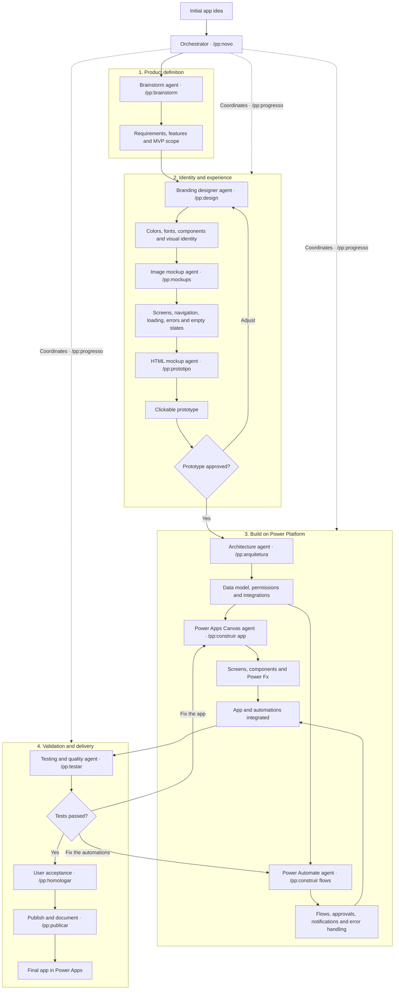

# Power Platform Kit for Claude Code


A Claude Code plugin that takes a **Power Apps Canvas + Power Automate** app from a one-line idea
to a published app, **one guided command at a time**. You don't need to know the method: every
step ends by telling you exactly which command to run next, in a fresh session. The backend can be
**SQL Server stored procedures** or **Dataverse**.

**Website:** <https://bruninhuco69.github.io/power-platform-skills/>

> **Language note.** The skill content (steps, rules, templates) is written in **Brazilian
> Portuguese**, and Power Fx examples follow the pt-BR formula bar (`;` as argument separator,
> `;;` to chain). Claude replies in the language you write in.

---

## Contents

- [How it works](#how-it-works)
- [Requirements](#requirements)
- [Install](#install)
- [Your first app, step by step](#your-first-app-step-by-step)
- [The agents](#the-agents)
- [Working on an existing app](#working-on-an-existing-app)
- [Component catalogs](#component-catalogs)
- [Conventions the kit enforces](#conventions-the-kit-enforces)
- [Repository layout](#repository-layout)
- [Contributing](#contributing)
- [Roadmap](#roadmap)
- [Credits and trademarks](#credits-and-trademarks)

---

## How it works



Three ideas make it easy to follow:

1. **One command per step.** Ten steps, `/pp:novo` to `/pp:publicar`. Each one checks that the
   previous step is done; run one out of order and it tells you which one to run instead.
2. **One fresh session per step.** Everything a step produces is written to disk, so the next step
   starts with a clean context. Every step ends with a **Next step** block like this one:

   ```text
   ## ▶ Próximo passo

   **Etapa 3 de 10 · Identidade visual** — Agente Designer Branding: cores, fontes, componentes e identidade visual

   `/pp:design`

   Abra uma nova sessão antes: digite `/clear` (ou feche e abra o Claude Code na pasta do projeto).
   ```

3. **You only stop where a human is needed:** approving the MVP, the visual identity and the
   prototype; creating tables, pasting screens and flows, running acceptance tests and publishing.
   Everything else is produced and validated for you.

Lost? `/pp:progresso` shows where the project is and the next command, any time. The state lives in
`ESTADO.md` at the project root.

## Requirements

| Need | For |
|---|---|
| [Claude Code](https://github.com/anthropics/claude-code) with plugin support | everything |
| Python 3.10+ | the project state and the validators (standard library only) |
| `pip install pyyaml` | `validar-telas.py` and the repo lint |
| A Power Platform environment (Power Apps Studio, Power Automate) | pasting, testing and publishing |
| *Optional:* an [OpenAI API key](https://platform.openai.com/api-keys) in `OPENAI_API_KEY` | the image mockups of step 4, the only step that calls an external API. Without a key the step continues without images |

## Install

Inside Claude Code:

```text
/plugin marketplace add Bruninhuco69/power-platform-skills
/plugin install pp@power-platform-kit
```

Or from a terminal:

```bash
claude plugin marketplace add Bruninhuco69/power-platform-skills
claude plugin install pp@power-platform-kit
```

Type `/pp:` in Claude Code: you should see the eleven step commands. If they don't show up in a
session that was already open, restart Claude Code.

**From a local clone** (to try changes before publishing):

```bash
git clone https://github.com/Bruninhuco69/power-platform-skills.git
claude plugin marketplace add ./power-platform-skills
claude plugin install pp@power-platform-kit
```

To update later: `claude plugin marketplace update power-platform-kit`, then `claude plugin update pp`.

## Your first app, step by step

Open Claude Code in an empty folder and type:

```text
/pp:novo an app to track orders across business units
```

Then follow the **Next step** block at the end of each step. In short:

| # | Command | Who works | What you do | What you get |
|---|---|---|---|---|
| 1 | `/pp:novo` | Orchestrator | tell the idea and the name; choose commit-per-step | git repo, `power-platform.config.json`, `00-LEIA-PRIMEIRO.md`, `ESTADO.md` |
| 2 | `/pp:brainstorm` | Brainstorm agent (talks with you) | pick a brainstorm mode; answer questions; pick what goes into the MVP | `docs/planejamento/brainstorm.md`, `prd.md` |
| 3 | `/pp:design` | Branding designer agent (talks with you) | choose colors, style and font; approve a visual sample | `ux-design-system.md`, `identidade.html` |
| 4 | `/pp:mockups` | Image mockup agent + script | check the screen list; authorize the images | `inventario-telas.md`, `mockups/*.png` |
| 5 | `/pp:prototipo` | HTML mockup agent | click through the prototype; approve or ask for changes | `prototipo/index.html` |
| 6 | `/pp:arquitetura` | Architecture agent | pick SQL Server or Dataverse; create the tables 🔴 | `arquitetura.md`, ADR, data scripts, `GOAL.md` |
| 7 | `/pp:construir` | Canvas agent ∥ Power Automate agent | paste screens and flows 🔴; one wave per session | `.pa.yaml` screens, flow JSON |
| 8 | `/pp:testar` | Testing and quality agent | run the test script in the environment 🔴 | `docs/qa/QA-<date>.md` |
| 9 | `/pp:homologar` | Orchestrator, with you | run acceptance with real users 🔴 | `docs/qa/UAT-<date>.md` |
| 10 | `/pp:publicar` | Orchestrator | publish to production 🔴 | user manual, technical guide, go-live checklist |

🔴 marks what only a human can do in the environment. At those points Claude shows a numbered
walkthrough (where to click, what to paste, what to check) and waits for you to type "feito" (done)
or paste the error.

### Four ways to brainstorm

Step 2 starts by asking how you want to think. Each mode is led by a persona; they differ only in
how the conversation opens. All four end the same way: MVP cut, business rules, blockers and
`prd.md`, so later steps don't care which one you chose.

| Mode | Pick it when | Led by |
|---|---|---|
| Guided interview | you already know what you want and need help closing it | 🧠 Facilitator |
| People first (design thinking) | the app changes the daily work of many people in different roles | 🎨 Experience designer: empathy map, a day in the life, "How might we…?" |
| Problem first (root cause) | something is broken (rework, errors, delays) and you want the cause | 🔬 Investigator: 5 whys, fishbone, bottleneck, reverse brainstorm |
| Round table | the idea is still vague and you want several points of view | 🧠 moderates 👤 end user, 💼 business, 😈 devil's advocate, plus 🎨 🔬 🛠️ 🛡️ as needed |

You can switch modes mid-session ("trocar de modo"); nothing in the log is lost. Personas ask and
propose; you decide. The personas are inspired by the BMAD Method's creative module and party mode.

### The loops

- **Prototype not approved:** your change requests go to `ajustes-prototipo.md`, and the next step
  is `/pp:design` again. It sorts each request into identity, screen or behavior, and the mockups
  and the prototype redo only what changed.
- **Tests or acceptance failed:** each failure goes to `docs/qa/correcoes.md`, tagged as app or
  flows, and the next step is `/pp:construir app` or `/pp:construir flows`. Testing runs again after
  the fix.

### Mockups (optional OpenAI key)

Step 4 can turn every screen into an image with the OpenAI Images API, using your palette. Claude
always validates the spec first (`--simular`: no key, no network), shows how many images and which
model, says that the screen descriptions go to OpenAI, and generates only after you say so. Sample
data is always fictitious.

Set the key **outside the chat**, then reopen Claude Code from a new terminal:

```powershell
setx OPENAI_API_KEY "<your-key>"        # Windows, permanent (open a new terminal)
```

```bash
export OPENAI_API_KEY="<your-key>"      # macOS/Linux, add it to ~/.bashrc or ~/.zshrc
```

The model is a variable: `--modelo` > `OPENAI_IMAGE_MODEL` > `mockups.modelo` in the config >
`gpt-image-2`. No key, or no security approval? Choose "don't generate": the prototype is built from
the screen inventory alone. Details: [`references/mockups.md`](skills/power-platform/references/mockups.md).

## The agents

| Agent | Step | Runs as | Tools |
|---|---|---|---|
| Brainstorm | `/pp:brainstorm` | the step's own session (it has to talk with you), as the persona of the chosen mode | — |
| Branding designer | `/pp:design` | the step's own session | — |
| `pp:agente-mockups` | `/pp:mockups` | subagent | read and write; **no shell**, so it can't call the image API |
| `pp:agente-prototipo` | `/pp:prototipo` | subagent | read, write, shell (prototype checker) |
| `pp:agente-arquitetura` | `/pp:arquitetura` | subagent | read, write, shell (procedure lint) |
| `pp:agente-canvas` | `/pp:construir` | subagent, in parallel with the next one | read, write, shell (`validar-telas.py`) |
| `pp:agente-automate` | `/pp:construir` | subagent | read, write, shell (`verificar-fluxo.py`) |
| `pp:agente-qa` | `/pp:testar` | subagent | read only, plus shell for the validators |

Subagents can't ask you questions, so the two agents that talk with you run in the step's own
session. The step that calls a subagent always re-checks its work (runs the validator, opens the
file) before moving on.

## Working on an existing app

| You say | What Claude does |
|---|---|
| "The KPI doesn't match the gallery" / "it's slow" / "it doesn't refresh" | **Investigate mode.** It walks the chain screen → formula → source → flow → procedure → data, tests one hypothesis at a time, and proves the root cause before proposing code. |
| "A user from one unit sees another unit's data" | Checks the layer that actually blocks access: the flow plus procedure on SQL, or security roles on Dataverse. The screen only filters. |
| "Audit the whole app" | Runs parallel reviewers per discipline (UX, development, performance, data, flows, SQL) and re-checks their strongest findings before reporting. |
| "Add a status filter to this screen" | Goes straight to `powerapps-canvas`, without the full protocol |
| "Promote to TEST/PROD" | Covers solutions, environment variables, connection references and `pac` CLI, and tells you what moves by paste versus by solution |
| "Is it ready?" | Runs the final gate: all applicable validators plus the checklist |

## Component catalogs

**Canvas — [`powerapps-canvas/assets/componentes/`](skills/powerapps-canvas/assets/componentes/INDICE.md)**
(23 components: paste-ready YAML)

| Group | Components |
|---|---|
| Layout and navigation | screen header, side menu, tabs, unit selector |
| Data | table gallery, expandable row, column sorting, cursor pagination, row count footer, bulk selection, status badge, KPI card |
| Filters and actions | filter bar, buttons, export |
| Modals | confirmation, form, informational, destructive-with-reason |
| Feedback | loading overlay, toast, empty state, no-access panel |

**Power Automate — [`power-automate/assets/componentes/`](skills/power-automate/assets/componentes/INDICE.md)**
(34 blocks: clipboard JSON plus notes)

| Group | Blocks |
|---|---|
| Triggers (typed by hand) | Power Apps (V2), HTTP intake |
| Core of an app-called flow | config, identify caller, read caller (SQL), switch on action, authorize by flag, deny + Terminate, normalize input, derive value, state before change, scope by unit, validate with message, audit trail, "nothing changed" guard, save via stored procedure, translate code and respond, connector catch |
| Dataverse variants | read caller (Dataverse), multi-unit scope, compensation when there's no transaction |
| Side effects and reports | resolve directory ID, support e-mail with partial result, screen filters as JSON, CSV export, HTML to PDF |
| HTTP intake and batch | intake config, token cache + HTTP response, map batch, single-row upsert, destination key index, Dataverse `$batch` upsert changeset, native pagination |
| Observability | run log |

Each `INDICE.md` gives the dependencies and maturity of every item. The Power Automate index adds
the assembly order for each type of flow. The Canvas index lists the variables each component
expects in `OnStart`, and the tokens are already in `app-formulas-tokens.md`.

## Conventions the kit enforces

These are the defaults. They're recorded in
[`decisoes-padrao.md`](skills/power-platform/references/decisoes-padrao.md), and changing one
requires an ADR.

- **One data track per project:** SQL Server *or* Dataverse.
- **Real names win.** Formulas and flows are written against the names read from the
  environment (`NOMES-AS-BUILT`), never against a plan.
- **Writes always go through a flow,** with the 4-field response and `.Run()` inside `IfError`.
- **The flow reads the user's identity from its own context** and authorizes every action.
  Flow parameters are positional, and a new one is always added at the end.
- **Separators depend on where the formula goes:** `;` / `;;` in the pt-BR formula bar,
  `,` / `;` in pasted YAML.
- **No environment literals in deliverables:** no server, `dev*` table or GUID. Use environment
  variables and connection references.
- **A generator never overwrites what was pasted.** The pasted file is the source of truth, and
  generated files go to `dist/`.
- **A ✅ needs evidence:** command, output and date. Evidence expires when the file changes.

## Repository layout

```text
.claude-plugin/          plugin.json + marketplace.json
agents/                  agente-mockups, agente-prototipo, agente-arquitetura,
                         agente-canvas, agente-automate, agente-qa
skills/
  novo/ brainstorm/ design/ mockups/ prototipo/ arquitetura/
  construir/ testar/ homologar/ publicar/ progresso/
                         the /pp:* step commands (thin: they point to the skills below)
  power-platform/        orchestrator: pipeline, state, routing, protocol, gates, ALM
    references/  assets/  prompts/
    scripts/estado.py  desenhar-mockups.py  verificar-prototipo.py
  powerapps-canvas/      references/  assets/componentes/  scripts/validar-telas.py
  power-automate/        references/  assets/componentes/  scripts/verificar-fluxo.py
  sql-procedures/        references/  assets/  scripts/lint-procedure.py
  dataverse/             references/  assets/  scripts/extrair-nomes-as-built.py
docs/
  PADRAO-SKILL.md        the standard every skill follows
  CONFIG.md              power-platform.config.json reference
tests/                   pytest suites for every script, the catalogs and the lint
tools/lint_skills.py     structure + sanitization lint
```

## Contributing

Every skill follows [`docs/PADRAO-SKILL.md`](docs/PADRAO-SKILL.md) (in Portuguese). Its main
rules:

- the frontmatter has a description that says when to use the skill and when not to;
- `SKILL.md` stays at 250 lines or fewer;
- detail goes in `references/`, copy-ready files in `assets/`;
- scripts take `--help` and return exit codes 0, 1 or 2;
- every script has tests.

Before opening a pull request:

```bash
pip install pyyaml pytest
python tools/lint_skills.py        # structure + sanitization, must print 0 erro(s)
python -m pytest tests -q          # scripts, catalogs and lint
claude plugin validate .           # manifest and frontmatter
```

**Sanitization.** This repository must not contain any of the following, and the lint blocks
them:

- machine paths, server names, tenant or environment IDs, or real GUIDs;
- e-mail addresses, other than `@contoso.com` style placeholders;
- business data or company names.

To block your own organization's internal names too, create `tools/sanitizacao.local.txt`
(git-ignored) with one regex per line.

## Roadmap

- A single `gate.py` that runs every validator for the layers a wave touched.
- A name checker that compares screens and flows against `NOMES-AS-BUILT`.
- `power-bi` skill: star schema, Power Query M, DAX.
- Trigger evals for each skill description.

See [`CHANGELOG.md`](CHANGELOG.md) for the release history.

## Credits and trademarks

- The planning cycle is **inspired by the [BMAD Method](https://github.com/bmad-code-org/BMAD-METHOD)**
  (MIT-licensed code by BMad Code, LLC). This project isn't affiliated with or endorsed by BMad
  Code, LLC. "BMad" and "BMad Method" are their trademarks, used here only to describe
  compatibility.
- Power Apps, Power Automate, Power Platform, Dataverse and SQL Server are trademarks of the
  Microsoft group of companies. This project isn't affiliated with Microsoft.
