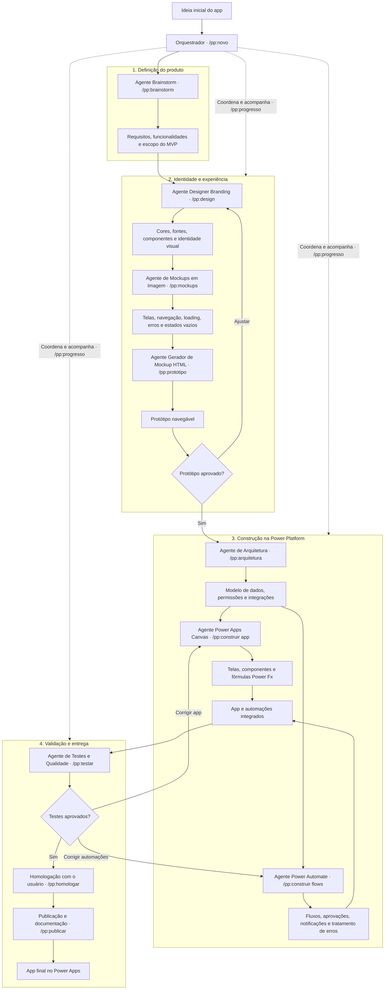

# Power Platform Kit para Claude Code


Plugin do Claude Code que leva um app **Power Apps Canvas + Power Automate** de uma ideia em uma
linha até o app publicado, **um comando guiado por vez**. Você não precisa conhecer o método: toda
etapa termina dizendo qual comando rodar em seguida, numa sessão nova. O backend pode ser **SQL
Server com stored procedures** ou **Dataverse**.

**Site:** <https://bruninhuco69.github.io/power-platform-skills/>

> **Idioma.** Tudo está em **português do Brasil**: etapas, regras, moldes, este README e o site.
> Os exemplos de Power Fx seguem a barra de fórmulas pt-BR (`;` separa argumentos, `;;` encadeia).
> A versão em inglês vem depois.

---

## Sumário

- [Como funciona](#como-funciona)
- [Requisitos](#requisitos)
- [Instalação](#instalação)
- [Seu primeiro app, passo a passo](#seu-primeiro-app-passo-a-passo)
- [Os agentes](#os-agentes)
- [Trabalhando num app que já existe](#trabalhando-num-app-que-já-existe)
- [Catálogos de componentes](#catálogos-de-componentes)
- [Convenções que o kit garante](#convenções-que-o-kit-garante)
- [Estrutura do repositório](#estrutura-do-repositório)
- [Como contribuir](#como-contribuir)
- [Próximos passos](#próximos-passos)
- [Créditos e marcas](#créditos-e-marcas)
- [Licença](#licença)

---

## Como funciona



Três ideias deixam o caminho fácil de seguir:

1. **Um comando por etapa.** São dez etapas, de `/pp:novo` a `/pp:publicar`. Cada uma confere se a
   anterior terminou; se você rodar fora de ordem, ela diz qual rodar no lugar.
2. **Uma sessão nova por etapa.** Tudo o que uma etapa produz fica gravado em disco, então a próxima
   começa com o contexto limpo. Toda etapa termina com um bloco **Próximo passo** como este:

   ```text
   ## ▶ Próximo passo

   **Etapa 3 de 10 · Identidade visual** — Agente Designer Branding: cores, fontes, componentes e identidade visual

   `/pp:design`

   Abra uma nova sessão antes: digite `/clear` (ou feche e abra o Claude Code na pasta do projeto).
   ```

3. **Você só para onde precisa de gente:** aprovar o MVP, a identidade visual e o protótipo; criar
   tabelas, colar telas e fluxos, rodar a homologação e publicar. O resto é produzido e validado
   para você.

Perdeu o fio? `/pp:progresso` mostra a qualquer momento onde o projeto está e o próximo comando. O
estado fica no `ESTADO.md`, na raiz do projeto.

## Requisitos

| O quê | Para quê |
|---|---|
| [Claude Code](https://github.com/anthropics/claude-code) com suporte a plugins | tudo |
| Python 3.10+ | o estado do projeto e os validadores (só biblioteca padrão) |
| `pip install pyyaml` | o `validar-telas.py` e o lint do repositório |
| Um ambiente Power Platform (Power Apps Studio, Power Automate) | colar, testar e publicar |
| *Opcional:* uma [chave da API da OpenAI](https://platform.openai.com/api-keys) em `OPENAI_API_KEY` | os mockups em imagem da etapa 4, a única que chama uma API externa. Sem a chave, a etapa segue sem imagens |

## Instalação

Dentro do Claude Code:

```text
/plugin marketplace add Bruninhuco69/power-platform-skills
/plugin install pp@power-platform-kit
```

Ou pelo terminal:

```bash
claude plugin marketplace add Bruninhuco69/power-platform-skills
claude plugin install pp@power-platform-kit
```

Digite `/pp:` no Claude Code: os onze comandos de etapa devem aparecer. Se não aparecerem numa
sessão que já estava aberta, reinicie o Claude Code.

**A partir de um clone local** (para testar mudanças antes de publicar):

```bash
git clone https://github.com/Bruninhuco69/power-platform-skills.git
claude plugin marketplace add ./power-platform-skills
claude plugin install pp@power-platform-kit
```

Para atualizar depois: `claude plugin marketplace update power-platform-kit` e, em seguida,
`claude plugin update pp`.

## Seu primeiro app, passo a passo

Abra o Claude Code numa pasta vazia e digite:

```text
/pp:novo um app para acompanhar pedidos entre as unidades
```

Depois é só seguir o bloco **Próximo passo** no fim de cada etapa. Em resumo:

| # | Comando | Quem trabalha | O que você faz | O que sai |
|---|---|---|---|---|
| 1 | `/pp:novo` | Orquestrador | conta a ideia e o nome; escolhe se cada etapa vira um commit | repositório git, `power-platform.config.json`, `00-LEIA-PRIMEIRO.md`, `ESTADO.md` |
| 2 | `/pp:brainstorm` | Agente Brainstorm (conversa com você) | escolhe o modo do brainstorm; responde às perguntas; decide o que entra no MVP | `docs/planejamento/brainstorm.md`, `prd.md` |
| 3 | `/pp:design` | Agente Designer Branding (conversa com você) | escolhe cores, estilo, fonte e o jeito de navegar; aprova uma amostra visual | `ux-design-system.md`, `identidade.html` |
| 4 | `/pp:mockups` | Agente de Mockups em Imagem + script | confere a lista de telas; autoriza as imagens | `inventario-telas.md`, `mockups/*.png` |
| 5 | `/pp:prototipo` | Agente Gerador de Mockup HTML | navega pelo protótipo; aprova ou pede ajustes | `prototipo/index.html` |
| 6 | `/pp:arquitetura` | Agente de Arquitetura | escolhe SQL Server ou Dataverse; cria as tabelas 🔴 | `arquitetura.md`, ADR, scripts de dados, `GOAL.md` |
| 7 | `/pp:construir` | Agente Canvas ∥ Agente Power Automate | cola telas e fluxos 🔴; uma onda por sessão | telas `.pa.yaml`, JSON dos fluxos |
| 8 | `/pp:testar` | Agente de Testes e Qualidade | roda o roteiro de teste no ambiente 🔴 | `docs/qa/QA-<data>.md` |
| 9 | `/pp:homologar` | Orquestrador, com você | faz a homologação com usuários reais 🔴 | `docs/qa/UAT-<data>.md` |
| 10 | `/pp:publicar` | Orquestrador | publica em produção 🔴 | manual do usuário, guia técnico, checklist de go-live |

🔴 marca o que só uma pessoa pode fazer no ambiente. Nesses pontos o Claude mostra um passo a passo
numerado (onde clicar, o que colar, o que conferir) e espera você digitar "feito" ou colar o erro.

### Quatro jeitos de fazer o brainstorm

A etapa 2 começa perguntando como você quer pensar. Cada modo é conduzido por uma persona; eles só
mudam o começo da conversa. Os quatro terminam do mesmo jeito: corte do MVP, regras de negócio,
bloqueadores e `prd.md`. Por isso as etapas seguintes não dependem do modo escolhido.

| Modo | Escolha quando | Quem conduz |
|---|---|---|
| Entrevista guiada | você já sabe o que quer e precisa de ajuda para fechar | 🧠 Facilitador |
| Foco nas pessoas (design thinking) | o app muda o dia a dia de muita gente, em perfis diferentes | 🎨 Designer de experiência: mapa de empatia, um dia na vida, "Como poderíamos…?" |
| Foco no problema (causa raiz) | algo está quebrado (retrabalho, erro, atraso) e você quer a causa | 🔬 Investigador: 5 porquês, espinha de peixe, gargalo, brainstorm reverso |
| Mesa redonda | a ideia ainda está vaga e você quer ouvir vários pontos de vista | 🧠 modera 👤 usuário da ponta, 💼 negócio e 😈 advogado do diabo, e chama 🎨 🔬 🛠️ 🛡️ quando precisa |

Dá para trocar de modo no meio ("trocar de modo") sem perder nada do log. As personas perguntam e
propõem; quem decide é você. Elas foram inspiradas no módulo criativo e no *party mode* do BMAD
Method.

### Cinco jeitos de navegar

Na etapa 3 o designer pergunta como o app leva de uma área para outra, mostrando um desenho de
cada opção. A escolha vale para os mockups, o protótipo e a construção.

| Padrão | Bom para |
|---|---|
| Menu lateral sempre aberto | uso diário no desktop, 3 ou mais áreas |
| Menu lateral recolhível (☰ alterna) | telas com tabela larga |
| Gaveta que abre por cima (hambúrguer) | tablet, tela estreita, uso eventual |
| Barra no topo | 2 a 6 áreas com nome curto |
| Tela inicial com cartões | uso eventual, uma tarefa por visita |

No protótipo, o seletor "Navegação" troca o padrão ao vivo para comparar; se preferir outro, é
um item de ajuste e o pipeline volta ao `/pp:design`.

### As voltas

- **Protótipo não aprovado:** os pedidos de ajuste vão para `ajustes-prototipo.md` e o próximo passo
  é `/pp:design` de novo. Ele classifica cada pedido em identidade, tela ou comportamento, e os
  mockups e o protótipo refazem só o que mudou.
- **Teste ou homologação com falha:** cada falha vai para `docs/qa/correcoes.md`, marcada como app
  ou fluxos, e o próximo passo é `/pp:construir app` ou `/pp:construir flows`. Depois da correção, o
  teste roda de novo.

### Mockups (chave da OpenAI opcional)

A etapa 4 pode transformar cada tela numa imagem com a API de imagens da OpenAI, usando a sua
paleta. O Claude sempre valida o spec antes (`--simular`: sem chave, sem rede), mostra quantas
imagens e qual modelo, avisa que a descrição das telas vai para a OpenAI e só gera depois que você
autoriza. Os dados de exemplo são sempre fictícios.

Configure a chave **fora do chat** e reabra o Claude Code num terminal novo:

```powershell
setx OPENAI_API_KEY "<sua-chave>"        # Windows, permanente (abra um terminal novo)
```

```bash
export OPENAI_API_KEY="<sua-chave>"      # macOS/Linux; coloque no ~/.bashrc ou ~/.zshrc
```

O modelo é uma variável: `--modelo` > `OPENAI_IMAGE_MODEL` > `mockups.modelo` no config >
`gpt-image-2`. Sem chave, ou sem aprovação da segurança? Escolha "não gerar": o protótipo é montado
só a partir do inventário de telas. Detalhes em
[`references/mockups.md`](skills/power-platform/references/mockups.md).

## Os agentes

| Agente | Etapa | Roda como | Ferramentas |
|---|---|---|---|
| Brainstorm | `/pp:brainstorm` | na própria sessão da etapa (precisa conversar com você), na pele da persona do modo escolhido | — |
| Designer Branding | `/pp:design` | na própria sessão da etapa | — |
| `pp:agente-mockups` | `/pp:mockups` | subagente | lê e escreve; **sem shell**, então não consegue chamar a API de imagens |
| `pp:agente-prototipo` | `/pp:prototipo` | subagente | lê, escreve, shell (verificador do protótipo) |
| `pp:agente-arquitetura` | `/pp:arquitetura` | subagente | lê, escreve, shell (lint de procedure) |
| `pp:agente-canvas` | `/pp:construir` | subagente, em paralelo com o próximo | lê, escreve, shell (`validar-telas.py`) |
| `pp:agente-automate` | `/pp:construir` | subagente | lê, escreve, shell (`verificar-fluxo.py`) |
| `pp:agente-qa` | `/pp:testar` | subagente | só lê, mais shell para os validadores |

Subagente não consegue fazer perguntas a você, por isso os dois agentes que conversam rodam na
própria sessão da etapa. A etapa que chama um subagente sempre confere o trabalho dele (roda o
validador, abre o arquivo) antes de seguir.

## Trabalhando num app que já existe

| Você diz | O que o Claude faz |
|---|---|
| "O KPI não bate com a galeria" / "está lento" / "não atualiza" | **Modo investigar.** Percorre a cadeia tela → fórmula → fonte → fluxo → procedure → dado, testa uma hipótese por vez e prova a causa raiz antes de propor código. |
| "Um usuário de uma unidade vê dados de outra" | Confere a camada que de fato bloqueia o acesso: fluxo + procedure no SQL, ou papéis de segurança no Dataverse. A tela só filtra. |
| "Audite o app inteiro" | Roda revisores em paralelo por disciplina (UX, desenvolvimento, performance, dados, fluxos, SQL) e confere de novo os achados mais fortes antes de relatar. |
| "Coloque um filtro de status nesta tela" | Vai direto para o `powerapps-canvas`, sem o protocolo completo. |
| "Promova para HML/PRD" | Cobre soluções, variáveis de ambiente, connection references e o CLI `pac`, e diz o que vai por colagem e o que vai por solução. |
| "Está pronto?" | Roda o portão final: todos os validadores que se aplicam, mais o checklist. |

## Catálogos de componentes

**Canvas — [`powerapps-canvas/assets/componentes/`](skills/powerapps-canvas/assets/componentes/INDICE.md)**
(25 componentes em YAML pronto para colar)

| Grupo | Componentes |
|---|---|
| Layout e navegação | cabeçalho de tela, menu lateral (fixo, recolhível ou gaveta), menu no topo, tela inicial com cartões, abas, seletor de unidade |
| Dados | galeria em tabela, linha expansível, ordenação por coluna, paginação por cursor, rodapé com contagem, seleção em lote, badge de status, card de KPI |
| Filtros e ações | barra de filtros, botões, exportação |
| Modais | confirmação, formulário, informativo, destrutivo com motivo |
| Feedback | overlay de carregamento, toast, estado vazio, painel sem acesso |

**Power Automate — [`power-automate/assets/componentes/`](skills/power-automate/assets/componentes/INDICE.md)**
(34 blocos: JSON de área de transferência mais notas)

| Grupo | Blocos |
|---|---|
| Gatilhos (digitados à mão) | Power Apps (V2), entrada HTTP |
| Núcleo do fluxo chamado pelo app | config, identificar quem chama, ler quem chama (SQL), switch por ação, autorizar por flag, negar + Terminate, normalizar entrada, derivar valor, estado antes da mudança, escopo por unidade, validar com mensagem, trilha de auditoria, guarda "nada mudou", gravar via stored procedure, traduzir código e responder, captura do conector |
| Variantes Dataverse | ler quem chama (Dataverse), escopo multiunidade, compensação quando não há transação |
| Efeitos colaterais e relatórios | resolver ID do diretório, e-mail de suporte com resultado parcial, filtros da tela como JSON, exportação CSV, HTML para PDF |
| Entrada HTTP e lote | config de entrada, cache de token + resposta HTTP, mapear lote, upsert de uma linha, índice de chave do destino, changeset de upsert `$batch` no Dataverse, paginação nativa |
| Observabilidade | log de execução |

Cada `INDICE.md` traz as dependências e a maturidade de cada item. O índice do Power Automate
acrescenta a ordem de montagem para cada tipo de fluxo. O do Canvas lista as variáveis que cada
componente espera no `OnStart`, e os tokens já estão em `app-formulas-tokens.md`.

## Convenções que o kit garante

São os padrões. Estão registrados em
[`decisoes-padrao.md`](skills/power-platform/references/decisoes-padrao.md), e mudar qualquer um
exige um ADR.

- **Uma trilha de dados por projeto:** SQL Server *ou* Dataverse.
- **O nome real vence.** Fórmulas e fluxos são escritos com os nomes lidos do ambiente
  (`NOMES-AS-BUILT`), nunca com os do plano.
- **Escrita sempre passa por um fluxo,** com a resposta de 4 campos e `.Run()` dentro de `IfError`.
- **O fluxo lê a identidade do usuário do próprio contexto** e autoriza cada ação. Os parâmetros do
  fluxo são posicionais, e um novo entra sempre no fim.
- **O separador depende de onde a fórmula vai:** `;` / `;;` na barra de fórmulas pt-BR, `,` / `;` no
  YAML colado.
- **Nenhum literal de ambiente nas entregas:** nada de servidor, tabela `dev*` ou GUID. Use
  variáveis de ambiente e connection references.
- **Gerador nunca sobrescreve o que foi colado.** O arquivo colado é a fonte da verdade, e o que é
  gerado vai para `dist/`.
- **✅ exige evidência:** comando, saída e data. A evidência vence quando o arquivo muda.

## Estrutura do repositório

```text
.claude-plugin/          plugin.json + marketplace.json
agents/                  agente-mockups, agente-prototipo, agente-arquitetura,
                         agente-canvas, agente-automate, agente-qa
skills/
  novo/ brainstorm/ design/ mockups/ prototipo/ arquitetura/
  construir/ testar/ homologar/ publicar/ progresso/
                         os comandos /pp:* de cada etapa (finos: apontam para as skills abaixo)
  power-platform/        orquestrador: pipeline, estado, roteamento, protocolo, portões, ALM
    references/  assets/  prompts/
    scripts/estado.py  desenhar-mockups.py  verificar-prototipo.py
  powerapps-canvas/      references/  assets/componentes/  scripts/validar-telas.py
  power-automate/        references/  assets/componentes/  scripts/verificar-fluxo.py
  sql-procedures/        references/  assets/  scripts/lint-procedure.py
  dataverse/             references/  assets/  scripts/extrair-nomes-as-built.py
docs/
  index.html             o site (GitHub Pages)
  PADRAO-SKILL.md        o padrão que toda skill segue
  CONFIG.md              referência do power-platform.config.json
tests/                   testes pytest de cada script, dos catálogos e do lint
tools/lint_skills.py     lint de estrutura + sanitização
```

## Como contribuir

Toda skill segue o [`docs/PADRAO-SKILL.md`](docs/PADRAO-SKILL.md). As regras principais:

- o frontmatter tem uma descrição que diz quando usar a skill e quando não usar;
- o `SKILL.md` fica com 250 linhas ou menos;
- detalhe vai em `references/`, arquivos prontos para copiar em `assets/`;
- scripts aceitam `--help` e retornam exit code 0, 1 ou 2;
- todo script tem testes.

Antes de abrir um pull request:

```bash
pip install pyyaml pytest
python tools/lint_skills.py        # estrutura + sanitização; precisa imprimir 0 erro(s)
python -m pytest tests -q          # scripts, catálogos e lint
claude plugin validate .           # manifesto e frontmatter
```

**Sanitização.** Este repositório não pode conter nada disto, e o lint barra:

- caminhos de máquina, nomes de servidor, IDs de tenant ou de ambiente, GUIDs reais;
- endereços de e-mail, exceto os de exemplo no estilo `@contoso.com`;
- dados de negócio ou nomes de empresa.

Para barrar também os nomes internos da sua organização, crie `tools/sanitizacao.local.txt`
(ignorado pelo git) com um regex por linha.

## Próximos passos

- Versão em inglês do README, do site e das skills.
- Um `gate.py` único que roda todos os validadores das camadas que uma onda tocou.
- Um conferidor de nomes que compara telas e fluxos com o `NOMES-AS-BUILT`.
- Skill `power-bi`: modelo estrela, Power Query M, DAX.
- Avaliações de gatilho para a descrição de cada skill.

O histórico de versões está no [`CHANGELOG.md`](CHANGELOG.md).

## Créditos e marcas

- O ciclo de planejamento e as personas do brainstorm são **inspirados no
  [BMAD Method](https://github.com/bmad-code-org/BMAD-METHOD)** (código sob licença MIT, de BMad
  Code, LLC). Este projeto não é afiliado nem endossado pela BMad Code, LLC. "BMad" e "BMad Method"
  são marcas deles, citadas aqui só para descrever compatibilidade.
- Power Apps, Power Automate, Power Platform, Dataverse e SQL Server são marcas do grupo de
  empresas Microsoft. Este projeto não é afiliado à Microsoft.

## Licença

[MIT](LICENSE). Pode usar, copiar, modificar e distribuir, inclusive em projetos comerciais,
desde que mantenha o aviso de copyright e a licença. O software vem sem garantia.
