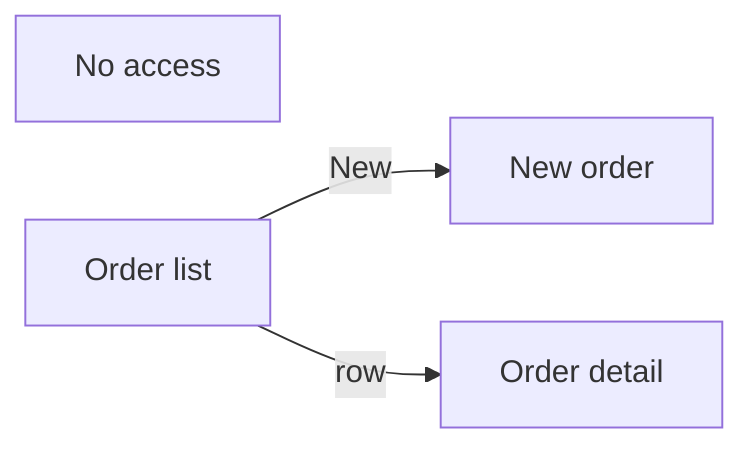

# Screen inventory — <PROJECT>

> Stage 4 (`/pp-en:mockups`), written by `pp-en:mockups-agent`. Inputs: PRD and design system.
> Output:
> - the app frame;
> - the navigation map;
> - every screen with roles, data, flows, delegation, pop-ups, notifications and priority;
> - the mockup spec.
>
> Column names here are **intent**; they become real names after `AS-BUILT-ENVIRONMENT` (N1).
> Examples: entity `Order`, units `AAA` and `BBB`.

## App frame (same on every screen)
| Piece | Decision | Catalog component |
|---|---|---|
| Header | <what it shows; user from context, never typed> | `screen-header` |
| Navigation | <the `ux-design-system.md` §2.1 pattern: fixed side, collapsible, drawer, top or cards> | `side-menu`, `top-menu` or `home-cards` |
| Unit selector | <only if the user sees more than one unit> | `unit-selector` |
| Notifications | <toast by `status`: success, warning, error; position and duration> | `toast` |
| Pop-ups | <confirmation, form, destructive with reason, informational> | `*-modal` |
| Loading | <on every `.Run()` call> | `loading-overlay` |
| States | <empty, truncated list, error, no access> | `empty-state`, `no-access-panel` |
| Footer | <"Showing N of M", version> | `count-footer` |

## Navigation map

## Master table
| Id | Screen | Goal | Roles (flag) | Priority | Requirements | Cut (rung on the ladder) |
|---|---|---|---|---|---|---|
| TL-01 | <name> | <one sentence> | `Flg_PodeVerPedido` | P0 | FR-01 | never cut |
| TL-02 | | | | P1 | | 2 |

## Screen sheet

### TL-01 — <name> (control prefix: `<prefix>`)
| Field | Content |
|---|---|
| Goal | |
| Roles that see / act | |
| Components (catalog) | |
| Data sources | table `Order`: columns <…>; expected volume per `Unit` `AAA` filter: <n> |
| Flows called | `<flow>`: positional parameters (text), return `{status, description, id, url}` |
| Delegation (T7) | delegates: <…>; does not delegate: <…>; cap: <500 or 2000>; does the counter show `2,000+`? |
| States | empty, loading, error, no access |
| Pop-ups | <modals the screen opens and the trigger of each> |
| Notifications | <action → toast (text comes in `description`); every write: loading + toast> |
| Mockup | `docs/planning/mockups/tl-01-<...>.png` (states: <...>) |
| Acceptance | <what the owner sees working> |

## Cut ladder
First to go → last: <TL-xx> → <TL-xx>. **Never cut:** <main cycle, audit trail,
per-action authorization in the flow>.

## Component catalog gaps
| Missing component | Screens that use it | Story that creates it |
|---|---|---|

## Exit gate
- [ ] Every P0 requirement in the PRD has a screen; every screen has a requirement.
- [ ] Every screen has sources, flows and delegation filled in.
- [ ] Frame and navigation map closed; every write action with loading and toast, every
      irreversible action with a modal.
- [ ] `desenhar-mockups.py --simular` with `0 error(s)`; mockups generated and approved. If there
      was no mockup, the waiver is recorded with who decided and why.
- [ ] Process owner recorded the inventory's acceptance (date).
