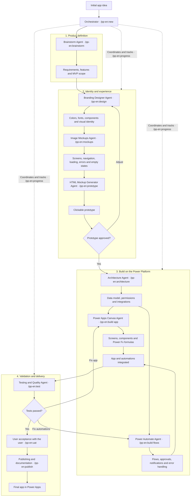

# Kit pipeline — from idea to published app

A new app goes through **10 stages**, each with a `/pp-en:*` command, in a **new session**. The
orchestrator (skill `power-platform` + `scripts/estado.py`) records where the project is in
`STATE.md` and, at the end of each stage, says which command comes next.

## Contents

1. [The design](#1-the-design)
2. [The stages](#2-the-stages)
3. [Loops back: adjustments and fixes](#3-loops-back-adjustments-and-fixes)
4. [Agents: who talks and who works alone](#4-agents-who-talks-and-who-works-alone)
5. [Where each file lives](#5-where-each-file-lives)
6. [Why one session per stage](#6-why-one-session-per-stage)
7. [BMAD (optional)](#7-bmad-optional)

---

## 1. The design

## 2. The stages

| # | Command | Who executes | What the user does | Delivers | Exit gate |
|---|---|---|---|---|---|
| 1 | `/pp-en:new` | Orchestrator | dumps the idea however it comes; chooses folder, commits and models | folder, git, config, `raw-idea.md`, `STATE.md` | `STATE.md` created |
| 2 | `/pp-en:brainstorm` | Brainstorm Agent (talks) | chooses the mode (interview, people, problem, round table) and answers the questions | `brainstorm.md`, `prd.md` with the MVP | every MVP requirement has a role and a priority; blockers have an owner |
| 3 | `/pp-en:design` | Branding Designer Agent (talks) | chooses colors, fonts, style | `ux-design-system.md` | palette in hex, contrast calculated, components from the catalog |
| 4 | `/pp-en:mockups` | Image Mockups Agent | authorizes (or not) generating the images | `screen-inventory.md`, `mockups/` | spec with `0 error(s)`; images generated or waiver recorded |
| 5 | `/pp-en:prototype` | HTML Mockup Generator Agent | opens the prototype and approves or asks for adjustments | `prototype/index.html` | verifier with `0 error(s)` and user sign-off |
| 6 | `/pp-en:architecture` | Architecture Agent (+ SQL Agents in parallel) | confirms the data track; creates the tables through the mockup load (on Dataverse, by the builder or the spreadsheet) and checks the 🔴 types | `architecture.md`, ADR, data scripts, mockup load (`.xlsx`, `.sql`; on Dataverse, plan and builder), `GOAL.md` | app ↔ flow contract closed; build queue in waves |
| 7 | `/pp-en:build` | Power Apps Canvas and Power Automate Agents, one per file group | pastes screens and flows into the environment 🔴 | screens `.pa.yaml`, flows `.json` | validators with `0 error(s)`; contract checked; pasted with no error |
| 8 | `/pp-en:test` | Testing and Quality Agent | runs the tests in the environment 🔴 | `docs/qa/QA-<date>.md` | all criteria pass, with evidence |
| 9 | `/pp-en:uat` | Orchestrator, with the user | leads the UAT with real users 🔴 | `docs/qa/UAT-<date>.md` | signed sign-off (who and when) |
| 10 | `/pp-en:publish` | Orchestrator | publishes to production 🔴 | `docs/delivery/` | app in production; manual and technical guide |

`/pp-en:progress` can run at any time: it shows the panel and the next command.

The build (stage 7) runs **one wave per session**: `GOAL.md` holds the waves, and
`/pp-en:build` takes the next one. The stage only closes when the last wave closes the gate.

## 3. Loops back: adjustments and fixes

| Where | When | What happens | Next command |
|---|---|---|---|
| Prototype | the user asks for an adjustment | the request goes to `docs/planning/prototype-adjustments.md` (round N); `estado.py reabrir design` | `/pp-en:design` (adjustment mode); it says whether the images and the prototype need to be redone |
| Tests | a screen fails | the list goes to `docs/qa/fixes.md`; `reabrir build --argumento app` | `/pp-en:build app` |
| Tests | a flow fails | same, `--argumento flows` | `/pp-en:build flows` |
| User acceptance | the user rejects | same; reopens build, test and uat | `/pp-en:build app` or `flows` |

Reopening a stage reopens the following ones that had already been touched: after fixing, the tests
run again. The reason stays in `STATE.md` and in the history.

**After publishing**, changes come through `/pp-en:change`: the list is scoped, each front becomes a
spec in `docs/changes/CHG-<NNN>.md`, the agents work in parallel, the session judges, the change's QA
runs and user acceptance and publishing reopen (`reabrir uat`). A big change (a new role or
entity, a track switch) reopens the pipeline at brainstorm.

## 4. Agents: who talks and who works alone

A subagent **does not talk to the user** (Claude Code removes the ask-a-question tool from it). So:

| Agent | How it runs | Why |
|---|---|---|
| Brainstorm, Branding Designer | the stage's own session takes the role (skill `/pp-en:brainstorm`, `/pp-en:design`); in brainstorm, as the persona of the chosen mode, or as several at the round table (`brainstorm-modes.md`) | the work is asking and deciding together |
| Image Mockups, HTML Mockup Generator, Architecture, SQL Server, Power Apps Canvas, Power Automate, Testing and Quality | plugin subagents (`pp-en:*-agent`), called by the stage | wide reading and file writing, no conversation; the session context stays clean |
| Research | subagent `pp-en:research-agent`, called when the stage needs a fact (license, connector, limit, error message, what already exists in the project) | read-only; returns a finding with its source, and the session decides |

The stage's session is the **head** and the agent is the **hand**: the session defines the request, judges
the delivery (runs the validator, opens the file, reads "How I verified" as a skeptic) and gives a verdict per agent:
✓ accepted, ↻ revision (the same agent, with a tighter request; at most two) or ⚠ escalated
(goes to the user). An error in the agent's file goes back to it: the session does not edit screens, flows
or procedures. The verdicts are kept in `STATE.md` and `/pp-en:progress` shows how many revisions each
stage needed. Detail: `references/subagents.md`.

## 5. Where each file lives

| File | Created in | Used in |
|---|---|---|
| `STATE.md` (root) | new | all: where the project is |
| `power-platform.config.json`, `00-READ-ME-FIRST.md` (root) | new | all |
| `docs/planning/raw-idea.md` | new: everything the user sent, as it came | brainstorm (confirms instead of asking) |
| `docs/planning/brainstorm.md`, `prd.md` | brainstorm | design onward |
| `docs/planning/ux-design-system.md` | design | mockups, prototype, build |
| `docs/planning/screen-inventory.md`, `mockups/` | mockups | prototype, architecture, build |
| `docs/planning/prototype/index.html`, `prototype-adjustments.md` | prototype | design (adjustment), build |
| `docs/planning/architecture.md`, `docs/decisions/ADR-*.md` | architecture | build, test, publish |
| `GOAL.md` (root) | architecture | build, test |
| `Backend/<track>/mockup-load.json`, `.xlsx`, `.sql`; `dataverse-plan.json` and `dataverse-builder/` (Dataverse) | architecture | human: create the tables (Dataverse, by the builder or the spreadsheet) or give data to DEV (SQL) |
| `AS-BUILT-ENVIRONMENT/` with `AS-BUILT-NAMES.md` | architecture (🔴 human) | build: real table and column name |
| screens and flows (`pastas` in the config) | build | test, publish |
| `docs/qa/` | test, uat | publish |
| `docs/changes/CHG-<NNN>.md` | change | uat, publish (new version) |
| `docs/delivery/` | publish | team and support |

## 6. Why one session per stage

- **Everything that matters is on disk.** Each stage reads the previous stage's files; nothing depends
  on the conversation's memory.
- **A clean context decides better.** A long brainstorm conversation carried into architecture
  drags along assumptions already discarded.
- **Anyone can pick it up.** Whoever opens the project tomorrow runs `/pp-en:progress` and knows the command.

How to open a new session: `/clear` in Claude Code, or close and reopen Claude Code in the project
folder. `/resume` goes back to an earlier conversation, if you need it.

## 7. BMAD (optional)

The brainstorm cycle and personas (`brainstorm-modes.md`, drawn from the creative module and the *party
mode*) are **inspired by the BMAD Method** (MIT code, (c) BMad Code, LLC; "BMad" and "BMad Method" are
their trademarks, cited only to describe compatibility; this kit is not affiliated with or endorsed by them).
Sources: <https://github.com/bmad-code-org/BMAD-METHOD> (`LICENSE`, `TRADEMARK.md`).

If the project already uses BMAD (`_bmad/` at the root or `bmad-*` skills available in the session),
`/pp-en:brainstorm` may use `bmad-brainstorming` for the ideas part, as long as the stage ends
with this kit's `prd.md` (it is what the following stages read). The rest of the pipeline is this kit's:
mockups, prototype, build and validators do not exist in BMAD.
