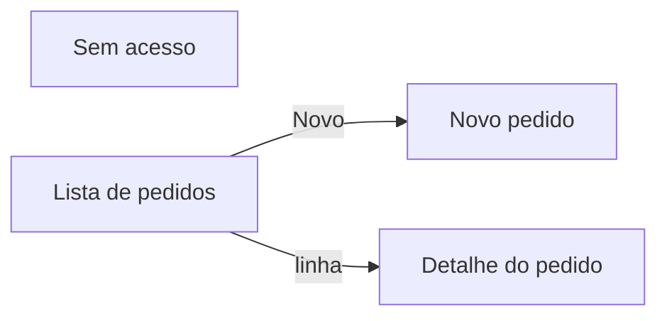

# Inventário de telas — <PROJETO>

> Etapa 4 (`/pp:mockups`), escrito pelo `pp:agente-mockups`. Entradas: PRD e design system.
> Saída:
> - a moldura do app;
> - o mapa de navegação;
> - toda tela com perfis, dados, flows, delegação, pop-ups, notificações e prioridade;
> - o spec dos mockups.
>
> Nomes de coluna aqui são **intenção**; viram nomes reais após o `AMBIENTE-AS-BUILT` (N1).
> Exemplos: entidade `Pedido`, unidades `AAA` e `BBB`.

## Moldura do app (igual em todas as telas)
| Peça | Decisão | Componente do catálogo |
|---|---|---|
| Header | <o que mostra; usuário pelo contexto, nunca digitado> | `cabecalho-tela` |
| Navegação | <o padrão do `ux-design-system.md` §2.1: lateral fixo, recolhível, gaveta, topo ou cartões> | `menu-lateral`, `menu-topo` ou `inicio-cartoes` |
| Seletor de unidade | <só se o usuário vê mais de uma unidade> | `seletor-unidade` |
| Notificações | <toast por `status`: sucesso, aviso, erro; posição e duração> | `toast` |
| Pop-ups | <confirmação, formulário, destrutivo com motivo, informativo> | `modal-*` |
| Loading | <em toda chamada `.Run()`> | `overlay-loading` |
| Estados | <vazio, lista truncada, erro, sem acesso> | `estado-vazio`, `painel-sem-acesso` |
| Rodapé | <"Exibindo N de M", versão> | `rodape-contagem` |

## Mapa de navegação

## Tabela mestre
| Id | Tela | Objetivo | Perfis (flag) | Prioridade | Requisitos | Corte (nº na escada) |
|---|---|---|---|---|---|---|
| TL-01 | <nome> | <uma frase> | `Flg_PodeVerPedido` | P0 | RF-01 | nunca corta |
| TL-02 | | | | P1 | | 2 |

## Ficha por tela

### TL-01 — <nome> (prefixo de controles: `<prefixo>`)
| Campo | Conteúdo |
|---|---|
| Objetivo | |
| Perfis que veem / agem | |
| Componentes (catálogo) | |
| Fontes de dados | tabela `Pedido`: colunas <…>; volume esperado por filtro da `Unidade` `AAA`: <n> |
| Flows chamados | `<flow>`: parâmetros posicionais (texto), retorno `{status, description, id, url}` |
| Delegação (T7) | delega: <…>; não delega: <…>; teto: <500 ou 2000>; contador mostra `2.000+`? |
| Estados | vazio, carregando, erro, sem acesso |
| Pop-ups | <modais que a tela abre e o gatilho de cada um> |
| Notificações | <ação → toast (texto vem em `description`); toda escrita: loading + toast> |
| Mockup | `docs/planejamento/mockups/tl-01-<...>.png` (estados: <...>) |
| Aceite | <o que o dono vê funcionando> |

## Escada de corte
Primeiro a sair → último: <TL-xx> → <TL-xx>. **Nunca corta:** <ciclo principal, trilha de auditoria,
autorização por ação no flow>.

## Lacunas do catálogo de componentes
| Componente faltando | Telas que usam | História que cria |
|---|---|---|

## Portão de saída
- [ ] Todo requisito P0 do PRD tem tela; toda tela tem requisito.
- [ ] Toda tela com fontes, flows e delegação preenchidos.
- [ ] Moldura e mapa de navegação fechados; toda ação de escrita com loading e toast, toda ação
      irreversível com modal.
- [ ] `desenhar-mockups.py --simular` com `0 erro(s)`; mockups gerados e aprovados. Se não houve
      mockup, a dispensa fica registrada com quem decidiu e por quê.
- [ ] Dono do processo registrou o aceite do inventário (data).
