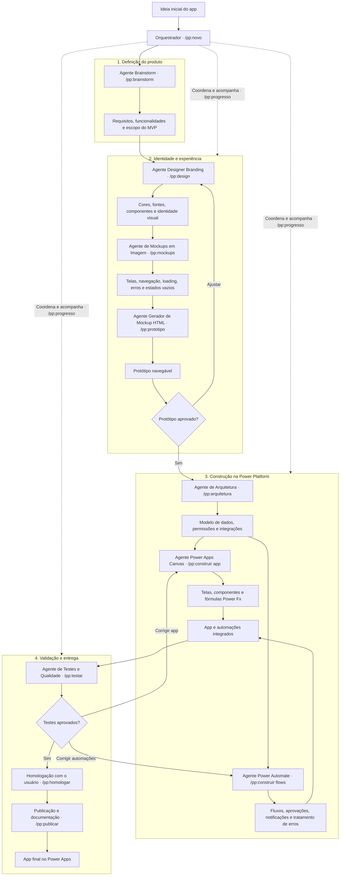

# Pipeline do kit — da ideia ao app publicado

Um app novo passa por **10 etapas**, cada uma com um comando `/pp:*`, numa **sessão nova**. O
orquestrador (skill `power-platform` + `scripts/estado.py`) guarda onde o projeto está no
`ESTADO.md` e, no fim de cada etapa, diz qual é o próximo comando.

## Sumário

1. [O desenho](#1-o-desenho)
2. [As etapas](#2-as-etapas)
3. [As voltas: ajuste e correção](#3-as-voltas-ajuste-e-correção)
4. [Agentes: quem conversa e quem trabalha sozinho](#4-agentes-quem-conversa-e-quem-trabalha-sozinho)
5. [Onde fica cada arquivo](#5-onde-fica-cada-arquivo)
6. [Por que uma sessão por etapa](#6-por-que-uma-sessão-por-etapa)
7. [BMAD (opcional)](#7-bmad-opcional)

---

## 1. O desenho

## 2. As etapas

| # | Comando | Quem executa | O que o usuário faz | Entrega | Portão de saída |
|---|---|---|---|---|---|
| 1 | `/pp:novo` | Orquestrador | conta a ideia e o nome | pasta, git, config, `ESTADO.md` | `ESTADO.md` criado |
| 2 | `/pp:brainstorm` | Agente Brainstorm (conversa) | escolhe o modo (entrevista, pessoas, problema, mesa redonda) e responde às perguntas | `brainstorm.md`, `prd.md` com o MVP | todo requisito do MVP com perfil e prioridade; bloqueadores com dono |
| 3 | `/pp:design` | Agente Designer Branding (conversa) | escolhe cores, fontes, estilo | `ux-design-system.md` | paleta em hex, contraste calculado, componentes do catálogo |
| 4 | `/pp:mockups` | Agente de Mockups em Imagem | autoriza (ou não) gerar as imagens | `inventario-telas.md`, `mockups/` | spec com `0 erro(s)`; imagens geradas ou dispensa registrada |
| 5 | `/pp:prototipo` | Agente Gerador de Mockup HTML | abre o protótipo e aprova ou pede ajuste | `prototipo/index.html` | verificador com `0 erro(s)` e aceite do usuário |
| 6 | `/pp:arquitetura` | Agente de Arquitetura | confirma a trilha de dados; cria as tabelas 🔴 | `arquitetura.md`, ADR, scripts de dados, `GOAL.md` | contrato app ↔ flow fechado; fila de construção em ondas |
| 7 | `/pp:construir` | Agentes Power Apps Canvas e Power Automate | cola telas e fluxos no ambiente 🔴 | telas `.pa.yaml`, fluxos `.json` | validadores com `0 erro(s)`; contrato conferido; colado sem erro |
| 8 | `/pp:testar` | Agente de Testes e Qualidade | roda os testes no ambiente 🔴 | `docs/qa/QA-<data>.md` | todos os critérios passam, com evidência |
| 9 | `/pp:homologar` | Orquestrador, com o usuário | conduz o UAT com usuários reais 🔴 | `docs/qa/UAT-<data>.md` | aceite assinado (quem e quando) |
| 10 | `/pp:publicar` | Orquestrador | publica em produção 🔴 | `docs/entrega/` | app em produção; manual e guia técnico |

`/pp:progresso` pode rodar a qualquer momento: mostra o painel e o próximo comando.

A construção (etapa 7) roda **uma onda por sessão**: o `GOAL.md` tem as ondas, e o
`/pp:construir` pega a próxima. A etapa só fecha quando a última onda fecha o portão.

## 3. As voltas: ajuste e correção

| Onde | Quando | O que acontece | Próximo comando |
|---|---|---|---|
| Protótipo | o usuário pede ajuste | o pedido vai para `docs/planejamento/ajustes-prototipo.md` (rodada N); `estado.py reabrir design` | `/pp:design` (modo ajuste); ele diz se as imagens e o protótipo precisam ser refeitos |
| Testes | falha na tela | a lista vai para `docs/qa/correcoes.md`; `reabrir construir --argumento app` | `/pp:construir app` |
| Testes | falha no fluxo | idem, `--argumento flows` | `/pp:construir flows` |
| Homologação | o usuário reprova | idem; reabre construção, testes e homologação | `/pp:construir app` ou `flows` |

Reabrir uma etapa reabre as seguintes que já tinham sido tocadas: depois de corrigir, os testes
rodam de novo. O motivo fica no `ESTADO.md` e no histórico.

## 4. Agentes: quem conversa e quem trabalha sozinho

Subagente **não conversa com o usuário** (o Claude Code tira dele a ferramenta de perguntar). Por isso:

| Agente | Como roda | Por quê |
|---|---|---|
| Brainstorm, Designer Branding | a própria sessão da etapa assume o papel (skill `/pp:brainstorm`, `/pp:design`); no brainstorm, na pele da persona do modo escolhido, ou de várias na mesa redonda (`brainstorm-modos.md`) | o trabalho é perguntar e decidir junto |
| Mockups em Imagem, Gerador de Mockup HTML, Arquitetura, Power Apps Canvas, Power Automate, Testes e Qualidade | subagentes do plugin (`pp:agente-*`), chamados pela etapa | leitura ampla e escrita de arquivos, sem conversa; o contexto da sessão fica limpo |

A etapa que chama um agente **confere** o que ele entregou (roda o validador, abre o arquivo) antes
de seguir: `references/subagentes.md`.

## 5. Onde fica cada arquivo

| Arquivo | Criado em | Usado em |
|---|---|---|
| `ESTADO.md` (raiz) | novo | todas: onde o projeto está |
| `power-platform.config.json`, `00-LEIA-PRIMEIRO.md` (raiz) | novo | todas |
| `docs/planejamento/brainstorm.md`, `prd.md` | brainstorm | design em diante |
| `docs/planejamento/ux-design-system.md` | design | mockups, protótipo, construir |
| `docs/planejamento/inventario-telas.md`, `mockups/` | mockups | protótipo, arquitetura, construir |
| `docs/planejamento/prototipo/index.html`, `ajustes-prototipo.md` | protótipo | design (ajuste), construir |
| `docs/planejamento/arquitetura.md`, `docs/decisoes/ADR-*.md` | arquitetura | construir, testar, publicar |
| `GOAL.md` (raiz) | arquitetura | construir, testar |
| `AMBIENTE-AS-BUILT/` com `NOMES-AS-BUILT.md` | arquitetura (🔴 humano) | construir: nome real de tabela e coluna |
| telas e fluxos (`pastas` do config) | construir | testar, publicar |
| `docs/qa/` | testar, homologar | publicar |
| `docs/entrega/` | publicar | equipe e suporte |

## 6. Por que uma sessão por etapa

- **Tudo o que importa está no disco.** Cada etapa lê os arquivos da anterior; nada depende da
  memória da conversa.
- **Contexto limpo decide melhor.** Uma conversa longa de brainstorm carregada para a arquitetura
  arrasta suposições já descartadas.
- **Qualquer pessoa retoma.** Quem abre o projeto amanhã roda `/pp:progresso` e sabe o comando.

Como abrir uma sessão nova: `/clear` no Claude Code, ou feche e abra o Claude Code na pasta do
projeto. `/resume` volta para uma conversa anterior, se precisar.

## 7. BMAD (opcional)

O ciclo e as personas do brainstorm (`brainstorm-modos.md`, a partir do módulo criativo e do *party
mode*) são **inspirados no BMAD Method** (código MIT, (c) BMad Code, LLC; "BMad" e "BMad Method" são
marcas deles, citadas só para descrever compatibilidade; este kit não é afiliado nem endossado).
Fontes: <https://github.com/bmad-code-org/BMAD-METHOD> (`LICENSE`, `TRADEMARK.md`).

Se o projeto já usa BMAD (`_bmad/` na raiz ou skills `bmad-*` disponíveis na sessão), o
`/pp:brainstorm` pode usar `bmad-brainstorming` para a parte de ideias, desde que a etapa termine
com o `prd.md` deste kit (é ele que as etapas seguintes leem). O resto do pipeline é deste kit:
mockups, protótipo, construção e validadores não existem no BMAD.
